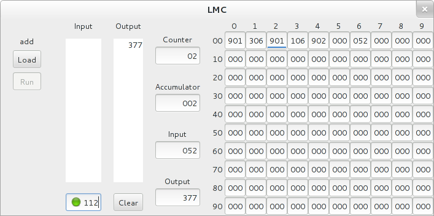

.. _console:

=========
 Console
=========

:command:`lmc console [<program>]`

The :command:`console` action displays a graphical interface to the LCM
emulator.  

The :samp:`Load` button opens a file selector for choosing an
assembled program.  When a program is loaded its name is printed above the
:samp:`Load` button.  After a program is loaded the :samp:`Run` button starts
execution. 

The input area provides a text field for entering numbers.  Input can be entered
before the program is stared.  The input is accumulated into a stack displayed
above the text field.  When the program requires input it takes the oldest entry
from the bottom of the stack.  If the stack is empty the text field becomes
active and the program is paused until an number is entered and :samp:`Return`
is pressed.  A green light is drawn in the text area to draw attention when
input is needed.

Output is accumulated in the area to the right of the input stack.  The output
area is like a printed tape.  Each new value appears at the top and pushes the
previous values down.  The :samp:`Clear` button erases the output.

To the right of the output is a column of text fields showing the contents of
the LMC's registers.  The contents of memory are shown in a grid of text fields.
The address of a field is found by adding the row and column labels for that
field.  While a program is running, a blue underline is drawn in the memory
field that holds the current instruction.  Until breakpoints, single-stepping,
and slow execution are implemented, this feature is only useful for
indicating the input instruction that's waiting for a value.
